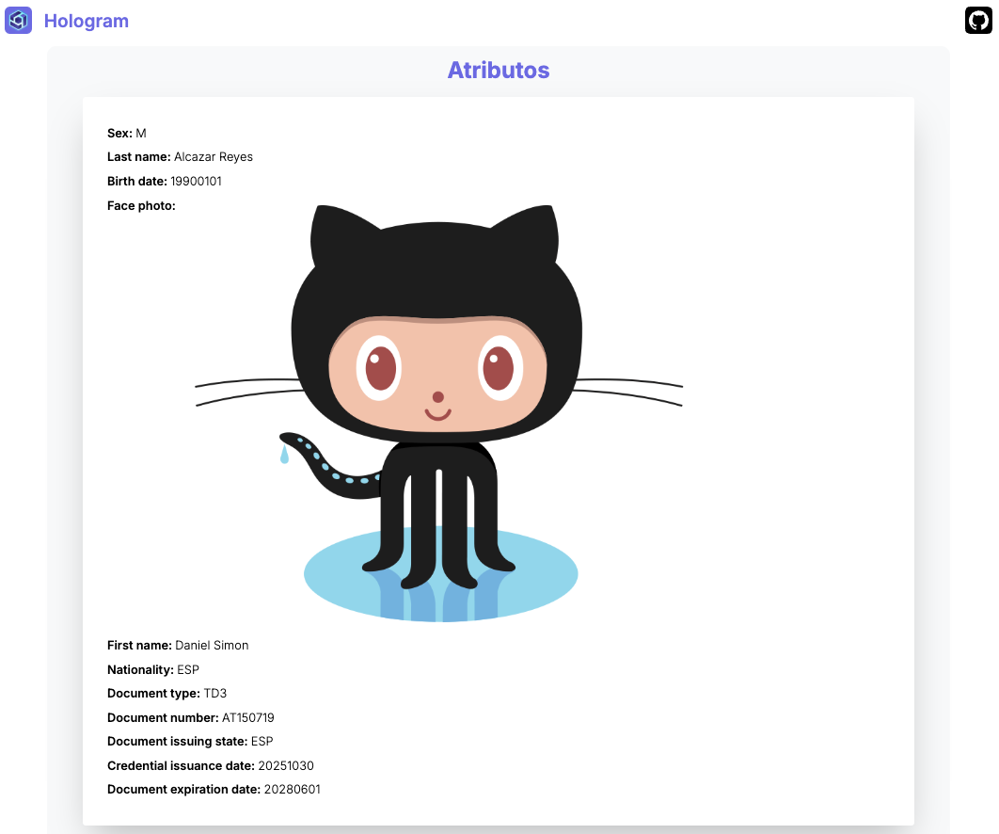

# Generic Verifier

This is a **DIDComm Verifiable Service** that allows you to request users to present a verifiable credential using the [Hologram Messaging mobile app](https://hologram.zone/).

This generic verifiable service can be used to request the presentation of **any type of credential**.

## Getting Started

### In credential JPEG 2000 (JP2) images

Sometimes, Verifiable Credentials derived from passports or ID cards may include images in the **JPEG 2000 (JP2)** format, which is not supported by most web browsers.

To address this, the project uses a command-line tool called [ImageMagick](https://imagemagick.org/script/command-line-tools.php) to modify and convert images. In particular, converting JP2 images to a more browser-friendly format like **PNG** may be necessary to ensure proper display.

It's recommended to install ImageMagick globally on your system. You can do this by following the official [installation guide](https://imagemagick.org/script/download.php).

Install dependencies

```bash
yarn install
```

### Run in developer mode

```bash
yarn dev
```

### Run in production mode

```bash
yarn build && yarn start
```

### Configuration

At the moment, all configuration is done by environment variables. While most of them are optional for development, this two (`CREDENTIAL_DEFINITION_ID` and `SERVICE_AGENT_ADMIN_BASE_URL`) are mandatory for production and test deployments.

| Variable                     | Description                                                                                                         | Default value         |
| ---------------------------- | ------------------------------------------------------------------------------------------------------------------- | --------------------- |
| NEXT_PUBLIC_BASE_URL         | Public URL without port where app is deployed                                                                       | http://localhost:3000 |
| NEXT_PUBLIC_PORT             | Port where app is listening                                                                                         | 3000                  |
| CREDENTIAL_DEFINITION_ID     | Unique identifier or Credential types                                                                               | `none`                |
| SERVICE_AGENT_ADMIN_BASE_URL | Service agent base URL                                                                                              | `none`                |
| ISSUER_DID                   | Optional public DID to let users connect to get their credentials in case they don't have any compatible credential | `none`                |
| ISSUER_LABEL                 | A label to show in the invitation to credential issuer                                                              | Issuer                |
| ISSUER_IMAGE_URL             | An URL pointing to an image to show in the invitation to credential issuer                                          | `none`                |

|

**Note:** For testing purposes, if you want your service to request the presentation of the **UnicID identity credential**, you should use the following values for `CREDENTIAL_DEFINITION_ID` and `SERVICE_AGENT_ADMIN_BASE_URL`:

- `CREDENTIAL_DEFINITION_ID`:  
  `did:web:chatbot-demo.dev.2060.io?service=anoncreds&relativeRef=/credDef/HngJhYMeTLTZNa5nJxDybmXDsV8J7G1fz2JFSs3jcouT`

- `SERVICE_AGENT_ADMIN_BASE_URL`:  
  `https://a.chatbot-demo.dev.2060.io`

These values are configured for the **ChatBot demo** and ensure correct functionality in the production environment.

If you'd like to request the presentation of a **different credential** issued by another service (e.g., one you've deployed yourself), follow these steps to retrieve the correct `CREDENTIAL_DEFINITION_ID`:

1. Locate the **Service Agent URL** for your deployed service.
2. Use the Swagger interface to call the method that lists available **credential definitions**.
3. Set `CREDENTIAL_DEFINITION_ID` to the identifier of your desired credential definition.

### About this app

This app was built using [Next.js framework](https://nextjs.org) and [Socket.IO](https://socket.io) for its web socket server.

## How to Use This App

1. **Install Hologram Messaging**  
   First, make sure you have [Hologram Messaging](https://hologram.zone) installed on your device. You can download it from the Google Play Store, Apple App Store, or Huawei App Gallery.

2. **Obtain a Credential from a demo Verifiable Service**  
   You need a Verifiable Credential issued by an Issuer Verifiable Service to proceed. If you don’t have one yet, and configured default values for `CREDENTIAL_DEFINITION_ID`, obtain your demo credential by connecting to the [UnicID identity credential](https://unic-id-issuer.demos.dev.2060.io/invitation).

3. **Scan the QR Code and Present Your Credential**  
   Open the Hologram app and scan the QR code shown on this web app. The mobile app will prompt you to present the required credential. After presenting it, you should see a confirmation screen similar to the one shown below.

   
